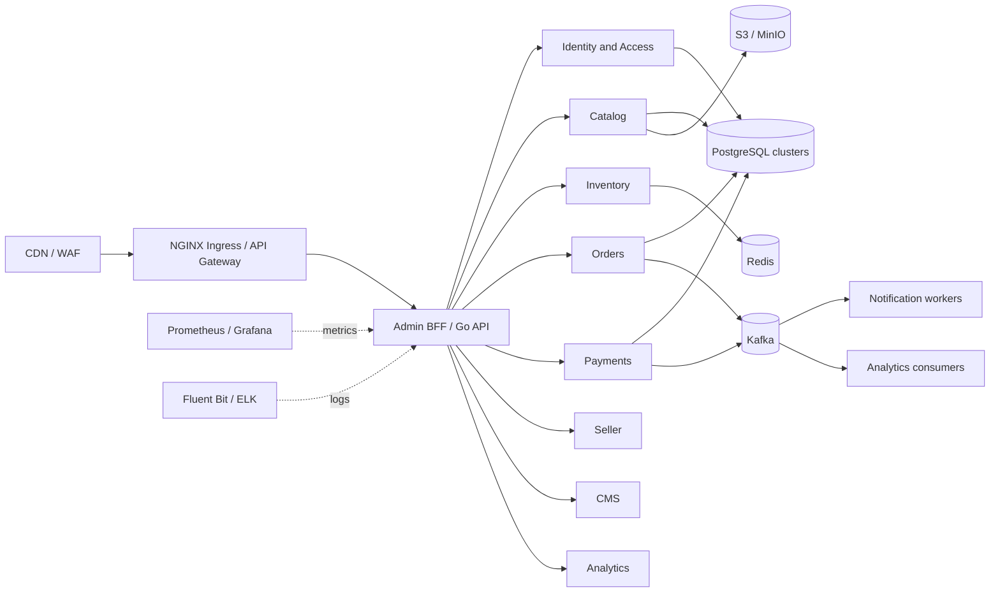

# FlashCart Enterprise Admin Blueprint

This document separates what the repository implements today from the architecture required for a high-volume marketplace. The current application is a useful modular-monolith/demo foundation, not a production-certified system capable of millions of concurrent users. Scaling to that level requires measured capacity planning, operational ownership, provider integrations, security review, and staged decomposition.

## Current implementation

- Go HTTP API, PostgreSQL, Redis, Kafka/Redpanda, order and notification workers, Prometheus/Grafana configuration, Docker and Kubernetes manifests.
- React/Vite storefront and admin console for products, flash sales, announcements, broadcasts, flash-sale analytics, orders, and Razorpay payments/refunds.
- Category CRUD with parent hierarchy, ordering, active state, banner URL, SEO metadata, slug validation, and child-safe deletion. Existing product category strings are seeded into the category table; the product-to-category foreign-key migration remains a later compatibility project.
- Authentication currently distinguishes `USER` and `ADMIN`; it does not yet implement a granular role/permission matrix, admin session revocation, or comprehensive audit trails.

## Target architecture

Split services only when independent scaling, ownership, or failure isolation justifies the operational cost. Begin with bounded Go modules and transactional PostgreSQL; use an outbox before introducing cross-service dual writes. Use gRPC for internal typed service contracts where needed, and versioned HTTP APIs for browser clients.

## Admin modules and workflows

| Module | Core admin workflow | Current state / next increment |
| --- | --- | --- |
| Identity and access | SSO/MFA -> role -> permission -> scoped session -> audit event | Basic JWT and `ADMIN` role; add RBAC, MFA, revocation, and audit before sensitive workflows |
| Dashboard and analytics | Date/store filters -> metric query -> drill-down -> export | Counts, revenue, and flash-sale funnel; add dimensional, asynchronous reporting |
| Catalog and categories | Draft -> media upload -> attributes/variants/SKU -> validation -> approval -> publish/index | Product CRUD and category CRUD; add normalized category IDs, variant/SKU model, moderation, and object storage |
| Inventory | Warehouse mapping -> reservation -> adjustment -> low-stock rule -> replenishment | Product-level stock plus flash-sale inventory; add warehouse ledger and idempotent reservations |
| Orders and fulfillment | Place -> authorize/capture -> reserve -> confirm -> pick/pack -> carrier -> delivery/return | Checkout and order/payment state machine; add fulfillment state, assignment, timeline, and invoice service |
| Customers and sellers | Profile/KYC -> risk review -> account actions -> payout/commission | Customer accounts and addresses; seller onboarding, KYC, payout, and risk tooling are not implemented |
| Payments and refunds | Gateway event -> reconciliation -> request -> approval -> provider refund -> ledger -> notify | Razorpay test flow and direct admin refund; add approval policy, idempotency, settlement ledger, and reconciliation |
| Promotions | Rule validation -> schedule -> eligibility -> redemption ledger -> reporting | Coupons and flash sales; add promotion rule engine and usage controls |
| CMS and notifications | Draft -> preview -> approve -> schedule -> publish/dispatch -> delivery status | Announcement and simulated broadcast; add versioned pages, provider delivery, templates, and consent enforcement |
| Platform configuration | Change request -> validation -> approval -> rollout -> audit | Environment configuration; add tenant/region settings and secret-manager integration |

### Product publishing

1. Create a draft product with category, attributes, and SEO metadata.
2. Upload images through short-lived S3/MinIO presigned URLs; persist object keys, not public credentials.
3. Add variants and generate/validate unique seller SKU identifiers.
4. Validate price, tax class, category, image policy, and required attributes.
5. Commit product and variant data transactionally, then write an outbox event.
6. Index asynchronously and initialize warehouse inventory; publish only after required checks pass.

### Order processing

1. Accept an idempotency key and validate cart, price, coupon, and delivery address.
2. Create a pending order and reserve inventory atomically or through an expiring reservation ledger.
3. Verify payment server-side or record COD authorization; never trust browser payment state.
4. A saga coordinates payment, inventory, and order confirmation; retries use idempotency keys and compensating actions.
5. Create fulfillment tasks, assign a carrier, publish status events, and notify the customer.
6. Preserve immutable order events for timeline, support, and reconciliation.

### Refund processing

1. Open a refund request with reason, item/quantity, and refundable amount validation.
2. Apply role/amount approval policy and prevent duplicate in-flight requests.
3. Submit an idempotent gateway refund and persist provider reference plus request/response metadata with secrets redacted.
4. Consume provider webhook/reconciliation results before marking the refund complete.
5. Update order/refund ledger, release eligible inventory, and notify the customer.

## Data model target

Use UUID primary keys, UTC timestamps, explicit status constraints, foreign keys, and `BIGINT` minor currency units. Partition high-volume append-only records by time where measurements justify it. Shard only after query patterns, key design, and operational tooling are proven.

| Domain | Tables (minimum target) |
| --- | --- |
| Identity | `users`, `admins`, `roles`, `permissions`, `role_permissions`, `admin_sessions`, `audit_logs` |
| Catalog | `products`, `product_variants`, `product_attributes`, `categories`, `product_media`, `approval_events` |
| Inventory | `warehouses`, `inventory_items`, `inventory_ledger`, `stock_reservations`, `replenishment_rules` |
| Orders | `orders`, `order_items`, `order_events`, `shipments`, `invoices`, `returns` |
| Commerce | `payments`, `refunds`, `settlements`, `sellers`, `seller_kyc`, `commissions`, `payouts`, `coupons`, `promotions` |
| Engagement | `notifications`, `notification_templates`, `notification_preferences`, `cms_pages`, `cms_assets` |

Add migrations with expand/backfill/validate/contract sequencing. Never rename/drop fields in the same deploy that first changes all application readers. Keep gateway secrets and API keys in a managed secret store, not application tables or frontend bundles.

## API surface target

All admin routes require authenticated identity, permission checks, request IDs, rate limits, and audit events. Use cursor pagination, stable sorting, validated filters, and consistent error envelopes.

| Resource | Example routes |
| --- | --- |
| Products / variants | `GET, POST /admin/products`; `GET, PATCH, DELETE /admin/products/{id}`; `POST /admin/products/{id}/publish` |
| Categories | `GET, POST /admin/categories`; `GET, PATCH, DELETE /admin/categories/{id}` |
| Inventory | `GET /admin/inventory`; `POST /admin/inventory/adjustments`; `GET, PUT /admin/warehouses/{id}` |
| Orders / fulfillment | `GET /admin/orders`; `GET /admin/orders/{id}`; `POST /admin/orders/{id}/transitions`; `POST /admin/orders/{id}/shipments` |
| Users / sellers | `GET /admin/users`; `GET, PATCH /admin/users/{id}`; `GET, POST /admin/sellers`; `POST /admin/sellers/{id}/kyc-review` |
| Payments / refunds | `GET /admin/payments`; `GET /admin/refunds`; `POST /admin/refunds/{id}/approve`; `POST /admin/refunds/{id}/execute` |
| Offers / CMS / notifications | `/admin/promotions`, `/admin/coupons`, `/admin/pages`, `/admin/notifications`, each with resource-specific CRUD and lifecycle actions |
| Analytics / settings | `GET /admin/analytics/{report}`; `GET, PATCH /admin/settings/{key}` with permission and approval controls |

The repository's existing `/admin` API is smaller; routes above are target contracts, not claims about implemented endpoints.

## Admin security baseline

- Replace role-only checks with deny-by-default permissions such as `catalog:write`, `orders:transition`, and `refunds:approve`; scope by tenant/store where applicable.
- Require MFA for privileged accounts and step-up verification for payouts, refunds, API keys, and permission changes.
- Use short-lived access tokens, rotating refresh tokens, server-side session revocation, secure cookies for browser sessions, CSRF protection where cookie auth is used, and strict HTTPS/HSTS.
- Audit actor, action, target, timestamp, request ID, outcome, and redacted before/after values. Make audit records append-only and restrict access.
- Validate inputs server-side; rate-limit by IP and principal; add WAF rules, account lockout/risk signals, IP allowlists for sensitive roles, secret rotation, and dependency/image scanning.
- Encrypt transport and managed database/object storage; avoid logging credentials, payment secrets, personal data, or raw authorization headers.

## Deployment and operations

- Build immutable, minimal Go/React container images; deploy through CI with unit, integration, API contract, dependency, and image scans.
- Use Kubernetes Deployments, readiness/liveness probes, resource requests/limits, PodDisruptionBudgets, HPA based on CPU and queue lag, and separate worker scaling.
- Put NGINX ingress/WAF in front of services; serve fingerprinted static assets from a CDN with private origin access.
- Use PostgreSQL managed HA, tested backups/PITR, connection pooling, read replicas for eligible reporting, and online migration practices. Do not claim sharding before load tests identify a bottleneck.
- Use Redis for bounded caches/rate-limit counters, Kafka with schema/version discipline and dead-letter handling, and circuit breakers/timeouts around providers.
- Instrument RED metrics, queue lag, DB pool saturation, cache hit rate, payment/refund outcomes, and business SLIs. Correlate structured logs and traces by request/event ID; alert on SLO burn, not only host health.

## Verification gates

1. Unit tests: permission decisions, order/refund state transitions, pricing, tax, idempotency, and validation.
2. Integration tests: real PostgreSQL/Redis/Kafka dependencies in ephemeral environments; migration from the previous schema and retry/failure paths.
3. Contract tests: OpenAPI compatibility for admin APIs and versioned Kafka schemas.
4. Security tests: authorization matrix, tenant isolation, session revocation, rate limits, injection, CSRF/XSS, secret scanning, and audit completeness.
5. UI tests: login/role visibility, catalog/category workflows, order transitions, refund approvals, error states, and responsive layouts.
6. Load tests: realistic read/write mixes, flash-sale contention, queue lag, graceful degradation, and recovery. Define target RPS, latency percentiles, error budget, and data set before calling a result production-ready.
7. Release gates: staged rollout, dashboards/alerts, rollback plan, backup restore drill, and documented on-call ownership.

## Recommended delivery order

1. Harden admin identity: RBAC, MFA, session revocation, permission matrix, and audit log.
2. Normalize catalog: categories to product foreign keys, variants/SKUs, media storage, draft/publish workflow, and contract tests.
3. Add warehouse inventory ledger, reservations, adjustments, alerts, and replenishment rules.
4. Add order fulfillment state machine, event timeline, invoices, carrier adapter, and SLA views.
5. Add refund approval/ledger/reconciliation, seller onboarding/KYC/commission/payout controls.
6. Expand CMS/notifications/promotions/settings, then analytics read models and operational dashboards.
7. Load-test each bottleneck and split bounded contexts into independently deployed services only when evidence supports it.